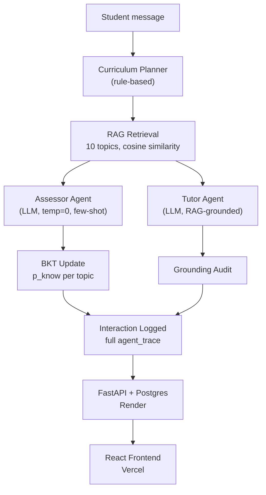

# 🎓 Intelligent Personalized Programming Tutor

### Agentic RAG Tutoring with BKT Skill Modeling and Full Decision Transparency

[**Live App**](https://programmingtutor-ai.vercel.app/) · [**API Docs**](https://intelligent-personalized-programming.onrender.com/docs) · [**Report Bug**](https://github.com/nikhil-0420/Intelligent-Personalized-Programming-Tutor/issues)

---

## 📌 Overview

Most AI tutoring demos are a single LLM call wearing a chat UI — no memory of what the student actually knows, no way to verify the response is grounded in real curriculum content, and no visibility into *why* the system responded the way it did.

This project builds a complete multi-agent tutoring system that:

- Tracks per-topic student mastery using **Bayesian Knowledge Tracing (BKT)**, updated automatically from both natural conversation and systematic practice questions
- Answers strictly from **retrieved curriculum content (RAG)**, not the model's general knowledge, with a live grounding audit on every response
- Routes reasoning across **three coordinated agents** — a rule-based Curriculum Planner, an LLM Assessor that judges correctness, and a RAG-grounded Tutor — logging every decision for full transparency
- Evaluates itself honestly across **three rigor tiers** (human evaluation, an automated LLM judge, and an exploratory manual check), reporting negative and non-significant results rather than smoothing them over

Unlike a single-notebook prototype, this system is deployed as a working full-stack application, with a **FastAPI + Postgres backend on Render** and a **React frontend on Vercel**, running entirely on free-tier infrastructure (Groq for inference, no paid API usage anywhere in the pipeline).
> ⚠️ **Note:** The backend runs on Render's free tier and may take 20–30 seconds to wake up on the first request.
---

## 🖥️ Dashboard Preview

### Chat & Insight Drawer

### Evaluation Dashboard

The app includes:

- **Chat** — topic-aware tutoring with mastery rings, an animated agent-flow indicator, code-syntax-highlighted responses, and a "Check my understanding" practice-question flow
- **Insight Panel** — a sliding drawer with three tabs: live mastery bars, per-message Assessor reasoning, and the full agent call trace
- **Evaluation** — human-eval confidence intervals, both ablation studies, and an honest diverging-bar breakdown of the classical scorer's results (including where it didn't work)

---

## ✨ Features

| Feature | Description |
| --- | --- |
| 🧠 **BKT Skill Modeling** | Four-parameter Bayesian Knowledge Tracing (p_know, p_transit, p_slip, p_guess) updates mastery per topic after every judged attempt |
| 🤖 **Multi-Agent Architecture** | Rule-based Curriculum Planner + LLM Assessor (temperature=0, few-shot) + RAG-grounded Tutor, each independently logged |
| 📚 **Retrieval-Augmented Generation** | 10-topic DSA curriculum, chunked and embedded locally (`all-MiniLM-L6-v2`), retrieved via cosine similarity |
| ✅ **Grounding Audit** | Every response scored for how well it reflects retrieved content, not just fluent-sounding text |
| ❓ **Systematic Assessment** | A distinct "practice question" interaction type, so BKT updates are driven by deliberate checks, not just opportunistic conversation |
| 💬 **Session Persistence** | Full chat history saved, browsable, and resumable, with feedback (👍/👎) captured per response |
| 📊 **Three-Tier Evaluation** | Human eval (17 raters, bootstrapped CIs) → automated LLM judge → exploratory manual check, reported in order of rigor |
| 🔬 **Two Ablation Studies** | RAG vs. no-RAG and single-agent vs. multi-agent, both at scale (n=120 / n=154), with honest non-significant results included |
| 🎯 **Explainable Scoring Layer** | A classical ML scorer (Ridge + SHAP) built to explain judge scores — its negative-R² result at small sample size is reported, not hidden |

---

## 🏗️ Tech Stack

**AI / ML**

- Llama 3.1 8B via [Groq](https://groq.com/) (free-tier inference) · [Ollama](https://ollama.com/) (local dev)
- sentence-transformers (`all-MiniLM-L6-v2`) for local embeddings
- Mistral (via Groq/Ollama) as an independent LLM judge, to avoid self-preference bias
- scikit-learn (Ridge regression) · SHAP

**Backend**

- FastAPI · SQLAlchemy · Uvicorn
- PostgreSQL (Render) · SQLite (local dev)
- Deployed on Render

**Frontend**

- React 19 + Vite
- Tailwind CSS · react-markdown · react-syntax-highlighter · lucide-react
- Deployed on Vercel

---

## 📐 Architecture

    Loading

---

## 📊 Evaluation Results

> **Methodology note:** results are reported across three tiers of decreasing rigor — human evaluation (independent raters, bootstrapped), an automated LLM judge (independent per-item API calls), and a manual single-session check (exploratory only, flagged as methodologically weaker). They are not conflated with each other.

### Tier 1 — Human Evaluation (Primary Result)

17 raters scored 20 interactions across 4 dimensions (340 total ratings). 95% CIs via two-level bootstrap (10,000 iterations).

| Dimension | Mean | 95% CI |
| --- | --- | --- |
| Groundedness | 4.19 | [4.08, 4.30] |
| Correctness | 4.24 | [4.10, 4.38] |
| Clarity | 4.21 | [4.08, 4.32] |
| **Pedagogical Fit** | **4.34** | **[4.22, 4.47]** |

### Ablation: RAG vs. No-RAG (n = 120)

| Metric | RAG | No-RAG | p-value | Significant? |
| --- | --- | --- | --- | --- |
| **Groundedness** | **0.742** | 0.708 | **< 0.0001** | ✅ Yes |
| Correctness | 0.731 | 0.719 | 0.167 | ❌ No |
| Pedagogical Fit | 0.756 | 0.738 | 0.059 | ❌ No (borderline) |

RAG's effect is specific to groundedness, not correctness or pedagogy — the model is already fairly capable on DSA fundamentals from pretraining alone. RAG helps in 9/10 topics; Sorting is a consistent exception, likely due to strong pretrained coverage of classic sorting algorithms.

### Ablation: Single-Agent vs. Multi-Agent (n = 154)

| Metric | Multi-Agent (Assessor) | Single-Agent | p-value | Significant? |
| --- | --- | --- | --- | --- |
| Assessment Accuracy | 89.0% | 83.8% | 0.169 (McNemar) | ❌ No |

A real 5.2-point gap that doesn't clear statistical significance at this scale — reported honestly rather than overstated. Per-topic mismatch varies widely (σ = 10.2): Sorting and Trees exceed 26%, Searching and DP show 0%.

### Classical Scorer (Ridge + LOO-CV + SHAP, n = 20)

Built to explain groundedness/clarity scores where the LLM judge hit a capability ceiling (e.g. scoring 5/5 groundedness on a response containing a fabricated historical claim, across 3 rounds of prompt iteration).

| Dimension | Leave-One-Out R² |
| --- | --- |
| Groundedness | −0.250 |
| Pedagogical Fit | −0.238 |
| Correctness | −0.217 |
| **Clarity** | **+0.192** |

At n = 20, three of four dimensions show negative R² — the model performs at or worse than predicting the mean. This is reported as an honest, inconclusive result at the current sample size, not a working scorer — motivating a larger labeled set before drawing conclusions about viability.

---

## 🚀 Getting Started

### Prerequisites

- Python 3.11+
- Node.js 18+
- [Ollama](https://ollama.com/) (for local LLM inference) *or* a free [Groq](https://console.groq.com/) API key

### 1. Clone the repository
git clone https://github.com/nikhil-0420/Intelligent-Personalized-Programming-Tutor.git
cd Intelligent-Personalized-Programming-Tutor

### 2. Backend setup
cd backend
python -m venv venv
venv\Scripts\activate # Windows
source venv/bin/activate # macOS/Linux
pip install -r requirements.txt
Create `backend/.env`:
LLM_PROVIDER=ollama
GROQ_API_KEY=your_groq_key_here # only needed if LLM_PROVIDER=groq
DATABASE_URL=sqlite:///./tutor.db # or a Postgres URL for hosted deployment
Seed the curriculum and start the server:
python -m app.curriculum.seed
python -m app.services.embed_chunks
uvicorn app.main:app --reload
Backend runs at `http://localhost:8000`
Docs at `http://localhost:8000/docs`

### 3. Frontend setup

cd frontend
npm install
npm run dev
Frontend runs at `http://localhost:5173`

### 4. Environment variables
Create `frontend/.env.local`:
VITE_API_URL=http://localhost:8000

---

## 📂 Project Structure

tutor-project/
├── backend/
│ ├── app/
│ │ ├── models/ # SQLAlchemy models (Student, Topic, SkillState, Interaction, ChatSession)
│ │ ├── services/ # bkt.py, planner.py, assessor.py, generation.py, retrieval.py,
│ │ │ # grounding.py, judge.py, feature_extraction.py, llm_client.py
│ │ ├── curriculum/ # seed.py
│ │ ├── main.py
│ │ ├── schemas.py
│ │ └── database.py
│ ├── curriculum_data/
│ │ └── dsa_topics.json # 10 topics, prerequisite chains, content chunks
│ ├── eval/
│ │ ├── human_eval/ # rating collection + analysis
│ │ ├── classical_scorer/ # feature extraction + training
│ │ ├── judge/ # LLM-as-judge validation set + runner
│ │ └── ablations/ # RAG vs no-RAG, single vs multi-agent
│ ├── tests/
│ └── requirements.txt
├── frontend/
│ └── src/
│ ├── components/ # ChatPanel, InsightDrawer, TopicPicker, SessionSidebar, etc.
│ ├── pages/ # HomePage, ChatPage, EvaluationPage
│ └── api.js
└── README.md

---

## 🔬 Methodology Highlights

1. **Curriculum Design** — 10 DSA topics with explicit prerequisite chains, chunked into explanation/example/practice-problem types for retrieval
2. **Skill Modeling** — 4-parameter BKT, with a decision transparency layer logging human-readable reasoning for every mastery update
3. **Multi-Agent Design** — a deliberate architectural choice: rule-based where logic is deterministic (Planner), LLM where reasoning over open text is genuinely needed (Assessor)
4. **Grounding Audit** — cosine-similarity check between response and retrieved chunks, flagged explicitly as heuristic, not proof
5. **Three-Tier Evaluation** — human eval as the primary result, an independent-call LLM judge as a scalable secondary check, and a manual single-session check explicitly demoted for its methodological weakness
6. **Ablation Studies** — isolating RAG's and the multi-agent architecture's individual contributions at n=120/n=154, reporting non-significant results rather than omitting them
7. **Reproducibility** — statistical tests independently rerun against saved raw data files, confirming identical results

---

## 🎯 Key Findings

- RAG's measurable benefit is **groundedness specifically**, not raw correctness — the base model already knows DSA fundamentals reasonably well from pretraining
- The multi-agent architecture shows a **real but not-yet-significant** accuracy advantage over a single combined agent — a directional finding, not an overstated one
- The automated LLM judge has a genuine **capability ceiling** on groundedness and clarity (confirmed across 3 rounds of prompt engineering), which directly motivated the pivot to a classical, explainable scorer
- The Assessor demonstrated real algorithmic verification in testing — e.g. correctly catching a student's array-rotation answer that used the wrong reversal order (left-rotation logic applied to a right-rotation question)

---

## 🔮 Future Work

- Scale the human-labeled set beyond n=20 to properly evaluate the classical scorer's viability
- LoRA fine-tuning on curriculum-specific tutoring dialogue (deliberately scoped out — hardware/data constraints didn't justify the effort/payoff at this stage)
- Expand the Assessor's cross-topic prompt tuning (currently strongest on recursion, weaker generalization to newer topics)
- A Socratic-questioning agent mode, as a stretch addition to the current explain/assess/practice loop

---

## 👤 Author

**Guddanti Nikhil Srinivas**
B.Tech AI & Data Science · Alliance University, Bengaluru
📧 <nikhil.guddanti@gmail.com>

[GitHub](https://github.com/nikhil-0420)

---

## 📄 License

This project is licensed under the MIT License — see the [LICENSE](https://github.com/nikhil-0420/Intelligent-Personalized-Programming-Tutor/blob/main/LICENSE) file for details.

---

**⭐ If you found this project interesting, consider giving it a star.**
